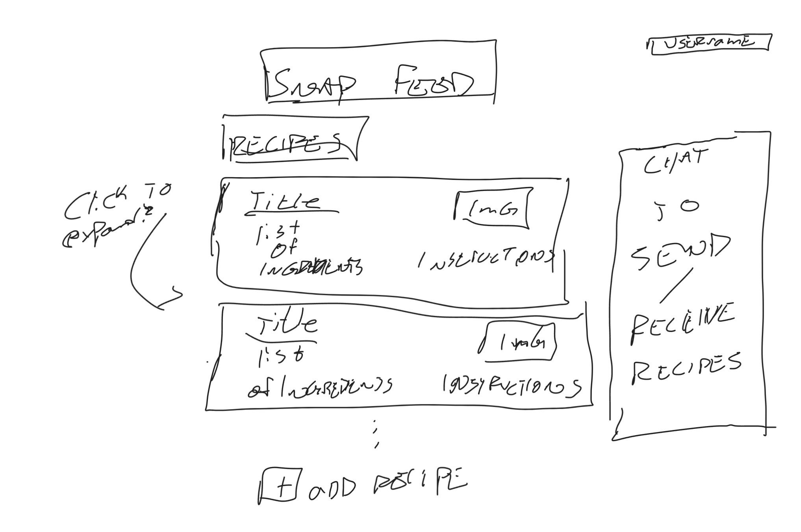

# SnapFeed

## Startup Specification

### Elevator Pitch

Meal prep can be a lifesaver. Whether you have fitness goals, a demanding schedule or maybe just enjoy a consistent schedule, meal prepping can make a world of difference. The goal of SnapFeed is to provide a platform for users to upload recipes, calculate ingredient amounts, and lay out meals for a week of eating so they can be more efficient in their meal preparataion. For this specific class I'll be focusing on getting a recipe to upload, save, be organized, and sent between users for now.

### Key Features

 - Secure login over HTTPS
 - **Recipes** will be displayed in the users home screen when they log in
 - The user will be able to **add** a new recipe by selecting the `+` button.
 - There will be a **chat** feature that allows the user to send recipes back and forth with 

### Design

### Technologies

 - **Authentication**: The user will login and have their name displayed in the top right corner to show they're in their profile
 - **Database data**: Recipes will be saved persistently inside the profile
 - **WebSocket data**: User will be able to chat with other users and send recipes back and forth
